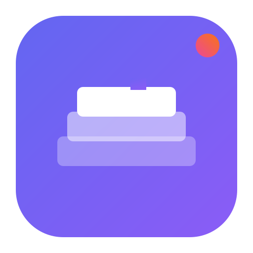
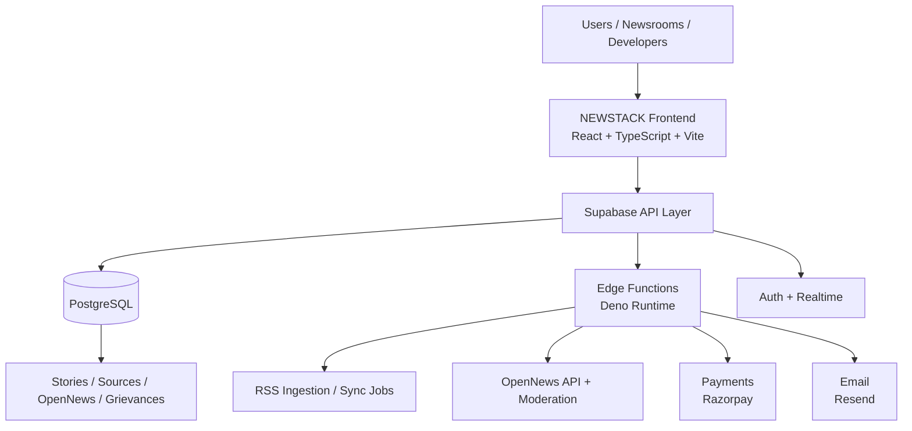

# NEWSTACK

<div align="center">
	
	<h3>AI-first Public News Intelligence Platform</h3>
	<p>Built by <strong>ORIGINX LABS</strong> for trusted, transparent, and scalable civic media infrastructure.</p>

	<p>
		
		
		
		
		
		
	</p>
</div>


## Tags

`#AI-News` `#CivicTech` `#OpenNews` `#PublicGrievances` `#OpenPolitics` `#NewsAPI` `#PWA` `#Razorpay` `#Supabase` `#Realtime`

## Table of Contents

- [Overview](#overview)
- [Core Product Modules](#core-product-modules)
- [Architecture](#architecture)
- [Technology Stack](#technology-stack)
- [Repository Map](#repository-map)
- [Documentation](#documentation)
- [Quick Start](#quick-start)
- [Environment and Secrets](#environment-and-secrets)
- [Support NEWSTACK / Donate NEWSTACK](#support-newstack--donate-newstack)
- [Roadmap Direction](#roadmap-direction)

## Overview

NEWSTACK is an enterprise-grade, AI-powered news intelligence platform focused on:

- Real-time India + global ingestion and structured story delivery
- Source verification, confidence-aware narrative handling, and context layering
- Public-interest workflows like grievance intake and tracking
- Open politics intelligence with modular civic datasets
- Developer and enterprise APIs for distribution and integration

## Core Product Modules

### Reader Experience
- News, India, World, and Places surfaces
- Multi-source trust context and story intelligence panels
- Text-to-Speech and accessibility-oriented flows
- Trending Pulse and live update experiences

### OpenNews Layer
- Open discussions with moderation pipelines
- Anonymous/named participation models
- Moderation queue, banned terms, and policy controls

### Civic & Public Infrastructure
- Public Grievances with ticket-based structure
- India-focused state and public data integrations

### Developer & Enterprise
- API pricing, subscriptions, and usage controls
- API key validation and usage metering
- Webhook and backend integration workflows

## Architecture



### High-Level Flow
1. Feeds and sources are ingested via scheduled functions.
2. Stories are normalized, enriched, and scored.
3. Frontend serves contextual intelligence across modules.
4. OpenNews and civic modules capture engagement and governance workflows.
5. Donation and API billing flows run through secure backend verification.

## Technology Stack

- **Frontend**: React 18, TypeScript, Vite, Tailwind CSS, shadcn/ui, Framer Motion
- **Data & State**: React Query, Supabase JS Client
- **Backend**: Supabase Postgres, Edge Functions, RLS Policies
- **Payments**: Razorpay (order + verification)
- **Email**: Resend transactional pipeline
- **Ops/Tooling**: ESLint, PostCSS, scripts-based migration and environment operations

## Repository Map

- `src/` — main app, pages, components, hooks, contexts
- `modules/opennews/` — modular OpenNews domain code
- `supabase/functions/` — edge functions (API, ingestion, auth, payment, email)
- `supabase/migrations/` — full schema and migration timeline
- `data/rss-feeds/` — curated feed datasets and audits
- `docs/` — module and social docs
- `scripts/` — migration, sync, smoke-test, and ops helpers

## Documentation

- Full architecture blueprint: [docs/architecture.md](docs/architecture.md)
- Full migration and infra guide: [MIGRATION_GUIDE.md](MIGRATION_GUIDE.md)
- OpenNews social module notes: [docs/opennews-social.md](docs/opennews-social.md)
- OpenNews module directory: [modules/opennews/README.md](modules/opennews/README.md)

## Quick Start

### Prerequisites
- Node.js 20+
- npm 10+
- Supabase project credentials

### Install
```bash
npm install
```

### Local Development
```bash
npm run dev
```

### Production Build
```bash
npm run build
```

### Vercel Deployment (Recommended)
Use:
- Build Command: `npm run build`
- Output Directory: `dist`
- Install Command: `npm install`

If routes work locally but not on Vercel, check `vercel.json` SPA fallback + static asset exclusions.

### Preview
```bash
npm run preview
```

## Environment and Secrets

Configure these for production-grade deployments:

- Supabase URL and keys
- `RAZORPAY_KEY_ID`
- `RAZORPAY_KEY_SECRET`
- `RESEND_API_KEY`

Reference the full configuration flow in [MIGRATION_GUIDE.md](MIGRATION_GUIDE.md).

## Support NEWSTACK / Donate NEWSTACK

NEWSTACK is designed as accessible public-interest infrastructure. If this platform helps your newsroom, org, or civic initiative, please support the mission.

- In-app support flow: **Support OpenNews / Support NEWSTACK**
- Donation mode: named or anonymous
- Minimum contribution support: ₹50+
- Contact: support@newstack.live
- Enterprise collaboration: sales@newstack.live

Your support sustains independent journalism infrastructure, transparent public systems, and open civic intelligence.

## Roadmap Direction

- Expanded multilingual intelligence coverage
- Deeper OpenNews moderation and trust signals
- Stronger civic workflow integrations and analytics
- Enterprise APIs and newsroom orchestration enhancements

---

### Ownership

Product and codebase managed by **ORIGINX LABS**.

© 2026 NEWSTACK by ORIGINX LABS. All rights reserved.
