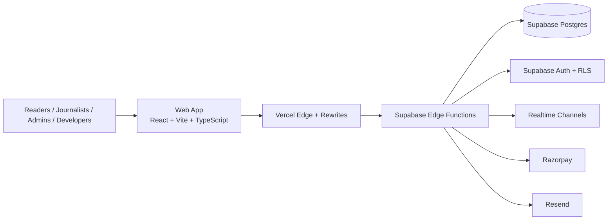
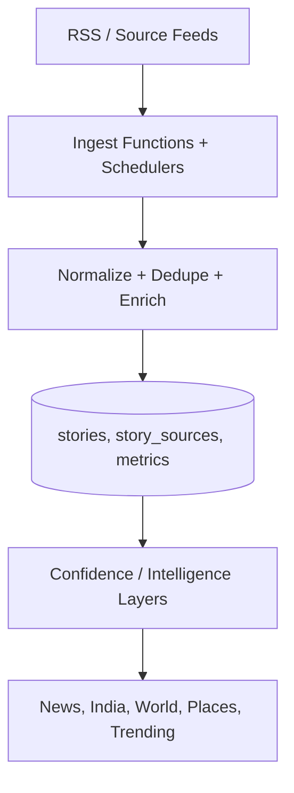
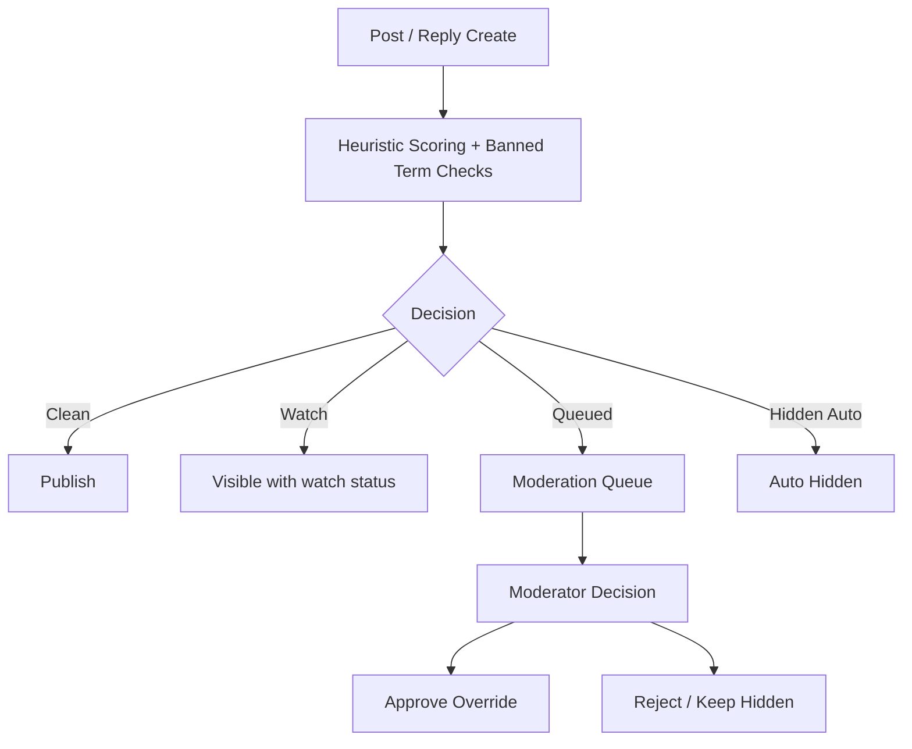
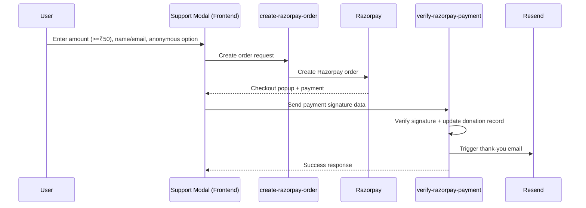

# NEWSTACK Architecture

## Platform at a Glance

NEWSTACK is designed as a modular, production-grade civic news intelligence system with frontend UX, API distribution, ingestion automation, moderation controls, and donation-backed sustainability.

---

## System Architecture

### Core Characteristics
- Frontend-first experience with route-based modules and PWA support
- Backend contracts served via Supabase edge functions
- Security model based on role checks and database policies
- Clear separation between ingestion flows, user flows, and governance flows

---

## Data & Processing Architecture

### Notes
- Feed health and publisher/state datasets are maintained under `data/rss-feeds/`
- Migration safety and schema evolution are managed under `supabase/migrations/`
- Operational scripts for sync/audit live under `scripts/`

---

## OpenNews Moderation Architecture

### Safety Layers
- Anonymous identity rate limiting
- Policy-driven ban and regex filters
- Queue + event logs for moderation accountability

---

## Payments & Donor Flow Architecture

---

## Repository Architecture Map

- `src/` → app pages, shared components, modules, UI flows
- `modules/opennews/` → OpenNews domain package structure
- `supabase/functions/` → ingestion, API, auth, payment, email logic
- `supabase/migrations/` → schema, RLS, feature rollout SQL
- `docs/` → architecture and product documentation
- `data/rss-feeds/` → feed datasets, audits, coverage snapshots

---

## Deployment Architecture (Vercel)

- Build command: `npm run build`
- Output directory: `dist`
- SPA fallback should route app paths to `/index.html` while preserving static assets
- API rewrites proxy app endpoints to Supabase edge functions

---

## Related Docs

- [Main README](../README.md)
- [Migration Guide](../MIGRATION_GUIDE.md)
- [OpenNews Social Notes](./opennews-social.md)
- [OpenNews Module README](../modules/opennews/README.md)
